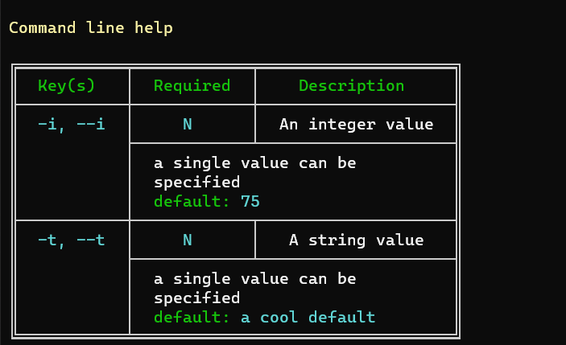

# J4JCommandLine: Colorful Help

This extension library adds the ability to display help information from within `J4JCommandLine` in a colorful and neatly formatted way.

[](https://www.nuget.org/packages/J4JSoftware.Configuration.CommandLine/)

The libraries are licensed under the GNU GPL-v3 or later. For more details see the [license file](../../LICENSE.md).

See the [change log](changes.md) for a history of significant changes.

## Usage

You use the extension by passing a new instance of `ColorHelpDisplay()` to the `DisplayHelp()` method::

```csharp
options.DisplayHelp( new ColorHelpDisplay() );
```

That gets you a display which looks like this:



`DisplayColorHelp` offers a few properties you can use to tweak the display:

| Property | What It Does |
|----------|--------------|
|CellPadding|Sets the padding within each cell of the table. The default is two spaces horizontally and no spaces vertically.|
|HeadingColor|Sets the color of the column headers. The default is *green*.|
|TitleColor|Sets the color for the help title. The default is *yellow*.|
|EmphasisColor|Sets the color used for emphasizing text such as keys. The default is *cyan*.|
|TextColor|Sets the color used for basic text. The default is *white*.|
|GridColor|Sets the color for the table grid. The default is *gray*.|
