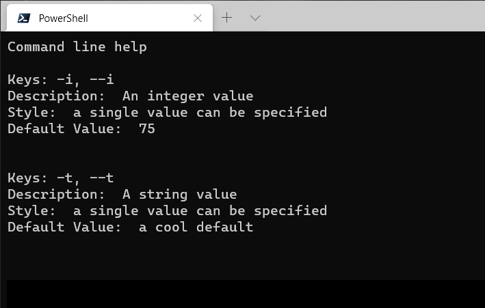

# Outputting Help

`J4JCommandLine` does not automatically output help information when a particular key exists in the command line that's being parsed. That's because it's intended to be used as part of the Net5 `IConfiguration` system, which can consolidate information from a wide variety of sources.

Instead, you force help information to be displayed by calling the `DisplayHelp()` method on an instance of `IOptionCollection`:

```csharp
options.DisplayHelp();
```

Calling `DisplayHelp()` without any arguments causes help information to be displayed using the default help formatter. This produces a very simple -- and not remotely typical -- display:



The simplicity results from me not wanting to invest the time developing code which could format help information in a more typical fashion. As a result I doubt anyone will rely on the default formatter.

There is an extension library available which provides nicely-formatted colorful help. For more information on using it [check out its documentation](../../ColorfulHelp/docs/readme.md).

## Implementing Your Own Help Formatter

Implementing your own help formatter simply involves creating a class which implements the `IHelpDisplay` interface:

```csharp
public interface IDisplayHelp
{
    void ProcessOptions( IOptionCollection options );
}
```

To make that easier there's a base class you can extend, which also offers a couple of helper methods, `HelpDisplay`:

```csharp
public abstract class HelpDisplay : IHelpDisplay
{
    protected HelpDisplay( 
        ILexicalElements tokens,
        OptionCollection collection 
        )
    {
        Tokens = tokens;
        Collection = collection;
    }

    protected ILexicalElements Tokens { get; }
    protected OptionCollection Collection { get; }

    public abstract void Display();

    protected List<string> GetKeys( IOption option ) {...}

    protected string GetStyleText( IOption option ) {...}
}
```
