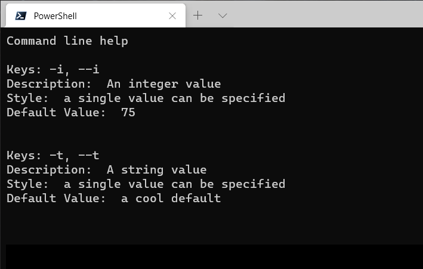

# J4JCommandLine
A Net5 library which adds parsing command line arguments to the IConfiguration
system.

[](https://www.nuget.org/packages/J4JSoftware.Configuration.CommandLine/)

### TL;DR

```csharp
using System;
using J4JSoftware.Configuration.CommandLine;
using Microsoft.Extensions.Configuration;
#pragma warning disable 8618

namespace J4JSoftware.CommandLine.Examples
{
    public class Program
    {
        static void Main(string[] args)
        {
            var options = new OptionCollection(CommandLineStyle.Linux);

            var intValue = options.Bind<Program, int>(x => Program.IntValue, "i");
            var textValue = options.Bind<Program, string>(x => Program.TextValue, "t");

            var config = new ConfigurationBuilder()
                .AddJ4JCommandLine(args, options)
                .Build();

            var parsed = config.Get<Program>();

            if (parsed == null)
            {
                Console.WriteLine("Parsing failed");

                Environment.ExitCode = -1;
                return;
            }

            Console.WriteLine("Parsing succeeded");

            Console.WriteLine($"IntValue is {IntValue}");
            Console.WriteLine($"TextValue is {TextValue}");

            Console.WriteLine(options.UnkeyedValues.Count == 0
                ? "No unkeyed parameters"
                : $"Unkeyed parameters: {string.Join(", ", options.UnkeyedValues)}");
        }

        public static int IntValue { get; set; }
        public static string TextValue { get; set; }
    }
}
```
### v1.0 Breaking Changes
The original version of this library did not integrate easily with the Net5
IConfiguration system. In addition, its error-checking/validation capabilities
required a lot of complex, behind-the-scenes code. That was, in part, due to its
duplicating some of the functionality of the IConfiguration system, as well as
doing validations which arguably ought to be done in application code.

Going forward I don't plan on any further development for the original version. It's
available as version 0.5.0.1.

### v1.1 Changes
You can now display help on the console:
```csharp
var options = new OptionCollection(CommandLineStyle.Linux);

var intValue = options.Bind<Program, int>( x => Program.IntValue, "i" )!
    .SetDefaultValue( 75 )
    .SetDescription( "An integer value" );

var textValue = options.Bind<Program, string>( x => Program.TextValue, "t" )!
    .SetDefaultValue( "a cool default" )
    .SetDescription( "A string value" );

options.DisplayHelp();

options.DisplayHelp( new DisplayColorHelp() );
```
Calling `DisplayHelp()` without a display formatter gives you a very
simple display:


Calling `DisplayHelp()` with the `DisplayColorHelp()` formatter gives you
this:


`DisplayColorHelp` is defined in an add-on assembly, *ColorfulHelp*. It's 
based on [CsConsoleFormat](https://github.com/Athari/CsConsoleFormat), a
cool library that makes it easy to colorize and structure console
output.

Default values can now be specified and will be used if nothing is
entered at the command line for an option.

I extracted the property validation logic (i.e., the code which
determines whether a property can be bound to an option). This doesn't
have any user-side impact. It's part of a longer-term effort to proposing
a modification to the overall Net5 `IConfiguation` system I'm working on.

### Table of Contents

- [Goal and Concept](docs/goal-concept.md)
- [Command Line Styles](docs/cmdlinestyle.md)
- [Binding](docs/binding.md)
- Examples
  - [Binding to static properties](docs/example-static.md)
  - [Binding to a configuration object](docs/example-instance.md)
- [Logging and Errors](docs/logging.md)
- [Outputting Help](docs/help.md)
- [Notes on the Tokenizer and Parser](docs/parser.md)

#### Inspiration and Dedication

This library is dedicated to Jon Sequitur, one of the leads on
Microsoft's own command line parser, for his patient explanations
of how that other parser is designed and his suggestions for
potential changes to it which eventually led to me writing
J4JCommandLine.

