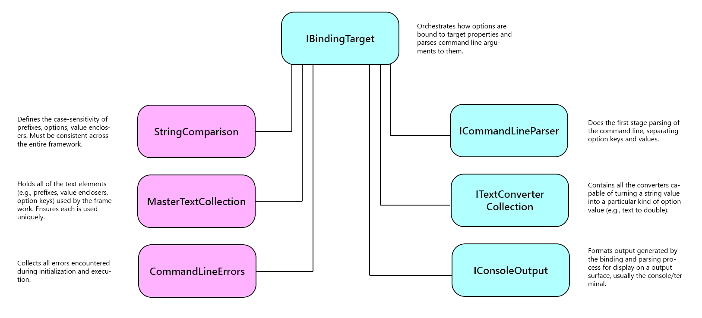
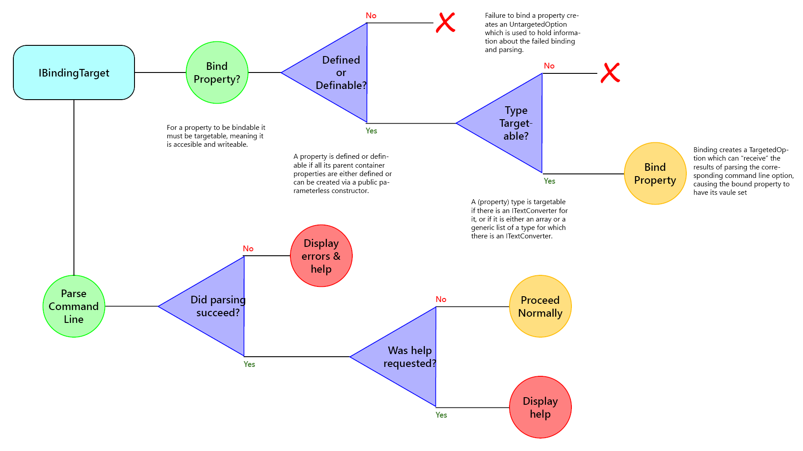

### Overview

While there are number of parts to the framework most of the action takes
place around **IBindingTarget**, whose default implementation is **BindingTarget**:



**IBindingTarget** works with several parameters which control how it operates:

- **StringComparison**: defines the case-sensitivity of the framework. This value 
must be consistent throughout the framework. That's enforced by setting it once,
in BindingTargetBuilder, which then takes care of ensuring consistency.
- **MasterTextCollection**: all of the "active" text elements (e.g., option prefixes,
value enclosers, quote marks and option keys) must be unique within the framework.
MasterTextCollection ensures that's the case, and keeps track of the role of each
active text element.
- **CommandLineErrors**: central repository of all errors encountered during
framework initialization and parsing. Similar to a logging function, but 
I decided incorporating an explicit logger made the output confusing when there
were errors (not that I didn't waste quite a bit of time before realizing that...).
- **ICommandLineParser**: does the first-level parsing of command line text, determining
which parts of the command line are option keys and which parts are text values
related to an option.
- **ITextConverter Collection**: Objects capable of turning a text value or values 
into a specific "output" type (e.g., text to double). Are also able to create
arrays and generic lists from multiple text values assigned to an option.
- **IConsoleOutput**: Formats the framework's output for display on some kind of 
output "surface", typically a console window.

### The Property Binding Process


*This section pertains to the upper part of the above diagram.*

The framework is designed to bind options to the public properties of a class. The
properties can be either instance properties or static properties, although for
static properties the property name must be prefaced by the name of the class
defining the static property.

Not all public properties can be bound, however. For starters, they must be of
a type for which the framework has a corresponding **ITextConverter** (they can
also be arrays or generic lists of supported types, too).

In addition, a bindable property has to be contained by a object which itself
exists during the binding phase or can be created from a public parameterless
constructor during the parsing phase. That "container must exist or be creatable"
constraint applies all the way back up the chain of containing properties.

For example, the **IntValue** property in this next example can be bound because all of
its containing properties have public parameterless constructors:

```
public class Parent
{
    public int IntValue { get; set; }
}

public class Grandparent
{
    public Parent Parent { get; set; }
}
```

However, the **IntValue** property in the following code *may* not be
bindable because the **Parent** containing property doesn't have a public
parameterless constructor:

```
public class Parent
{
    public Parent( object someObject )
    {
    }

    public int IntValue { get; set; }
}

public class Grandparent
{
    public Parent Parent { get; set; }
}
```

The reason UnbindableIntValue *may* not be bindable is because if you specify
a pre-existing **Grandparent** instance -- which has already created its
**Parent** child property -- the framework will allow you to bind to
**IntValue**.

### The Allocating and Parsing Process


*This section pertains to the lower part of the above diagram.*

What most people think of as "parsing" is, within this library, actually a 
combination of the **allocating** process and a **conversion/validation/assignment** 
process. Because the latter term is too long I refer to it here as
"parsing"...which is admittedly somewhat confusing. Sorry about that.

"Parsing" takes place after allocation. Converting, validating
and assigning property values to bound properties is inextricably linked
to configuration information about what an option should be (e.g., a text
value, a double, a binary switch). That's what most people think of as the
entirety of parsing a command line.

Allocation doesn't concern itself with any of that detail. It focuses on
breaking up a command line into pieces, determining which pieces are keys
(indicating that an option is being declared) and which are simply text
values.

For more information about this please read [Terminology](terminology.md).

When the overall parsing process runs it may or may not succeed and the user may or
may not have requested help. Requesting help is considered a "failure" but it's
possible the rest of the parsing process succeeded. That means you could continue
with the execution of your program after help is requested...but that'd be odd.

If there are errors, both information about the errors and the standard help 
information is output via **IConsoleOutput**. If help is requested just the
standard help information is output.