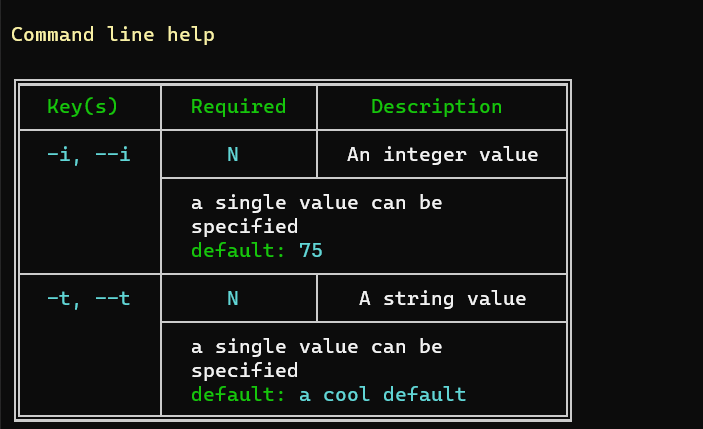

# J4JCommandLine
A Net Core 3.1 library for parsing command line arguments 
in a flexible fashion.

### Inspiration and Dedication

This library is dedicated to Jon Sequitur, one of the leads on
Microsoft's own command line parser, for his patient explanations
of how that other parser is designed and his suggestions for
potential changes to it which eventually led to me writing
J4JCommandLine.

### Goal and Concept

There are a number of C# command line parsers out there, several
of which I've used. So why write another one? 

Well, in part because, for me at least, I only really understand
a library after I've (re)written it. I was intrigued by some
of the design issues I learned about from Jon and wanted to
get a better feel for how to implement them.

But there was a bigger reason. I view C# as a type-centered
language. While it has many other characteristics at its core
everything seems to revolve around types. Because of that I
tend to thing of "parsing a command line" as "converting a
bunch of text into an instance of a configuration type". I 
wanted a library that was centered around types.

That's an ad hoc restriction. There are plenty of other targets
one could imagine turning command line text into (e.g., in C#,
fields or method variables). But it's a pretty powerful
and flexible restriction, I think, because once you have 
command line information in a type you can go anywhere you
want (e.g., assign information to method variables, call
methods defined in the configuration object using the
command line values, etc.).

I also wanted the library to work with dependency injection.
Initially that was a very pervasive design consideration but ultimately
it ended up being fairly trivial. The primary library has a related 
Autofac support library (I love Autofac -- it's worth checking out).

Finally, I wanted the library to be relatively easily extensible and
customizable. Consequently, most of its core revolve around key
interfaces. The guts of the code implement those interfaces and glue
them together into a functioning whole. But you should be able to 
customize the bits and just drop them into the overall framework (that's
dependency injection for you :)).

### Usage

Using the library is straightforward. Here's the code from the 
ConsoleAppJ4JCmdLine project which I use to examine how information and
errors get displayed when a console app is run:

```
using System;
using Autofac;
using Autofac.Extensions.DependencyInjection;
using J4JSoftware.CommandLine;
using Microsoft.Extensions.DependencyInjection;

namespace ConsoleAppJ4JCmdLine
{
    public class Program
    {
        static void Main(string[] args)
        {
            InitializeServiceProvider();

            var builder = ServiceProvider.GetRequiredService<BindingTargetBuilder>();

            builder.Prefixes( "-", "--", "/" )
                .Quotes( '\'', '"' )
                .HelpKeys( "h", "?" )
                .Description( "a test program for exercising J4JCommandLine" )
                .ProgramName( $"{nameof(Program)}.exe" );

            builder.Build<Program>(null, out var binder, out var _);

            if( binder == null )
                throw new NullReferenceException( nameof(Program) );

            binder.Bind( x => Program.IntValue, "i" )
                .SetDescription( "an integer value" )
                .SetDefaultValue( 1 )
                .SetValidator( OptionInRange<int>.GreaterThan( 0 ) );

            binder.Bind( x => Program.TextValue, "t" )
                .SetDescription( "a text value" )
                .SetDefaultValue( "some text value" );

            if( binder.Parse( args ) != MappingResults.Success )
            {
                Environment.ExitCode = 1;
                return;
            }

            Console.WriteLine($"IntValue is {IntValue}");
            Console.WriteLine($"TextValue is {TextValue}");
        }

        public static IServiceProvider ServiceProvider { get; set; }
        public static int IntValue { get; set; }
        public static string TextValue { get; set; }

        private static void InitializeServiceProvider()
        {
            var builder = new ContainerBuilder();

            builder.RegisterType<FancyHelpErrorProcessor>()
                .AsImplementedInterfaces()
                .SingleInstance();

            builder.AddJ4JCommandLine();

            ServiceProvider = new AutofacServiceProvider(builder.Build());
        }
    }
}
```

All you do is invoke an instance of BindingTargetBuilder to create
a BindingTarget for your configuration type, bind properties of the
configuration type to option keys and call Parse() on the BindingTarget.
If the result is anything other than MappingResults.Success there was
a problem (and you should probably abort the app).

Along the way you can set option descriptions, default values and 
validators. The subsystem for displaying errors and help is defined
when the BindingTargetBuilder instance is created. It's a constructor
parameter, and in the example created on the fly by the Autofac
dependency injection framework.

There's a default/basic help/error display engine in the core library.
But there's also one that produces fancier output defined in the 
FancyHelpError project. Here's what the output looks like:

